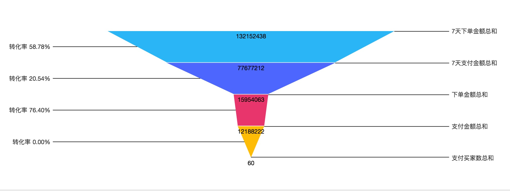

# react-radial-bar-chart
漏斗图(梯形图) by canvas

### How to use
```javascript
import FunnelChart from 'react-funnel-chart';

<FunnelChart />

```

### FunnelChart Props
```javascript
{
  list: [
    { name: 'Q1', value: 500, backgroundColor: '', ... },
    { name: 'Q2', value: 400, backgroundColor: '' },
    { name: 'Q3', value: 300, backgroundColor: '' },
    { name: 'Q4', value: 200, backgroundColor: '' },
  ],
  onClick: (e, ringInfo), // default
  onHover: (e, ringInfo), // default
  onResize: ({ ratio, clientWidth, clientHeight, ratioWidth, ratioHeight }, e), // default
  isGradient: false,
  labelStyle: '#333',
  dataStyle: '#000',
  strokeStyle: '#000',
  tooltip: {  
    show: false, // default
    formatter: (ringInfo) => {
      return `数值: ${ringInfo.value}`;
    }
  },
  tooltipStyle: {
    backgroundColor: 'rgba(0,0,0,0.65)',
    ...
  },
}
```

### Base Package
[color-conversion-rgb](https://github.com/justQing00/color-conversion)

[react-chart-canvas](https://github.com/justQing00/react-chart-canvas)

### Effect


### Changelog
##### 0.1.0
非传统漏斗图，目前为满足当前需求，后续增加配置项来适配其他情况

